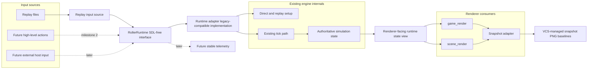

# RollerRuntime extraction design

- **Date:** 2026-08-02
- **Status:** Design approved in chat; pending written-spec review
- **Diagram:** `docs/superpowers/diagrams/roller-runtime-architecture.mmd`

## Goal

Extract the game loop toward a reusable `RollerRuntime` module so the game simulation can be driven outside the current executable loop. The long-term consumers are tests, tooling, editor integration, and external engines.

The first useful milestone is not arbitrary high-level input. It is a replay-driven runtime path that can run the existing snapshot harness. Replay loading/parsing stays outside `RollerRuntime`; the runtime consumes an input/timeline source and must reproduce the existing VCS-managed snapshot PNG baselines.

## Non-goals for the first milestone

- Do not rewrite physics, control, replay, or race rules.
- Do not expose SDL in the public runtime interface.
- Do not expose a `RollerRuntime_RenderFrame` function.
- Do not design the final external-engine rendering interface yet.
- Do not replace the existing snapshot harness immediately.

## Design principles

### Final interface first, minimal implementation first

Create the `RollerRuntime` seam now, but initially implement it as a thin strangler around the existing exact tick path. The interface should be stable and SDL-free; the implementation may still drive legacy globals and existing functions while parity is established.

### Runtime and rendering remain separate modules

`RollerRuntime` owns and advances authoritative simulation/game state. It does not render.

Framebuffer production belongs to renderer consumers. Existing `game_render` and `scene_render` should become consumers of runtime state, and a future public renderer module can wrap those consumers. `RollerRuntime_RenderFrame` would be too tightly coupled and is explicitly rejected.

### Existing snapshot PNGs are the baseline

The current VCS-managed snapshot PNGs remain authoritative. A runtime-driven snapshot path should write the same baseline files and use the existing git-diff workflow to detect pixel drift.

## Target architecture

## Public `RollerRuntime` surface

The public runtime interface should use plain C types and should not require including SDL headers. The first version should support only replay-driven stepping:

- create/destroy runtime
- configure deterministic/headless runtime settings
- attach or select a caller-owned input source
- step a fixed number of logical ticks
- query status/error information

A future milestone can add high-level player action input. That input is still valuable for tests, bots, and external engines, but replay-sourced stepping comes first because it has lower parity risk and plugs directly into the existing snapshot baseline. The replay file format and loader remain a separate module/adapter concern, not a `RollerRuntime` responsibility.

## Runtime implementation strategy

The initial implementation should preserve behavior by driving the existing code path:

- consume replay playback through a separate replay/input-source adapter
- reuse current RNG behavior
- call `tick_clock_step`, `game_tick_step`, and `control_one_tick` as the primary stepping mechanism; any replacement must prove parity first
- bypass frontend/menu flow for runtime-driven tests
- disable or stub audio, network, window, and SDL input devices
- keep any SDL use internal and temporary

The runtime adapter translates public runtime calls into the legacy state transitions the current engine already understands. The public interface must not expose `Car[]`, SDL events, scancodes, or mutable globals.

## Renderer-facing runtime state

The renderer-facing state view is the key seam between runtime and rendering.

Initially, this view may be the existing legacy global state. That is acceptable because it maximizes parity and minimizes extraction risk. Over time, `game_render` and `scene_render` should read through a more explicit state view owned by `RollerRuntime` rather than freely reaching into mutable legacy globals.

The intended direction is:

1. `RollerRuntime` drives legacy state.
2. Existing snapshot rendering reads that runtime-driven state and reproduces current PNG baselines.
3. `game_render` and `scene_render` gradually consume an explicit runtime-state view.
4. A future `RollerRenderer` module can provide public rendering/presentation functionality while staying separate from `RollerRuntime`.

## Snapshot migration strategy

Add a parallel runtime snapshot build step before replacing the current harness:

- keep `zig build test-snapshots` unchanged
- add `zig build test-runtime-snapshots`
- drive the same replay/frame list through `RollerRuntime`
- capture the same PNG filenames under `tests/snapshots/baselines/`
- compare by the existing VCS-managed baseline workflow

Because the PNGs are version controlled, a mismatch naturally appears as a working-tree diff. An optional scratch mode may write to `zig-out/runtime-snapshot-scratch/` for manual debugging, but the main acceptance path should use the checked-in baselines.

Migration stages:

1. **Parallel path:** existing snapshots remain authoritative; runtime snapshots prove parity.
2. **Divergence debugging:** if runtime snapshots differ, compare legacy-harness and runtime-harness output to isolate extraction regressions.
3. **Default switch:** once stable, make `test-snapshots` use the runtime path.
4. **Old driver removal:** after a confidence period, remove the legacy snapshot driver path.

## Milestones

### Milestone 1: replay-driven runtime snapshot parity

- Introduce SDL-free `RollerRuntime` public interface.
- Implement replay/input-source attachment and fixed stepping through the runtime adapter.
- Wire a parallel `test-runtime-snapshots` build step.
- Use existing VCS-managed snapshot PNG baselines as the authoritative comparison.
- Acceptance: both `zig build test-snapshots` and `zig build test-runtime-snapshots` pass against the same baselines.

### Milestone 2: stable runtime observability

- Add small telemetry/status structs for tests and tools.
- Keep telemetry copied out of runtime state; do not expose mutable legacy state.
- Use telemetry for debugging and targeted tests after snapshot parity is established.

### Milestone 3: high-level input source

- Extend the input-source abstraction behind `RollerRuntime`.
- Support high-level player actions such as steering, throttle, brake, gear up/down, and action/cheat.
- Convert those actions into the same legacy input data path as current gameplay.
- Use this for controllable simulations, bots, fuzz tests, and external host integration.

### Milestone 4: explicit renderer-facing state view

- Move `game_render` and `scene_render` toward consuming a runtime-owned state view.
- Keep rendering separate from runtime.
- Prepare a future `RollerRenderer` module without adding `RollerRuntime_RenderFrame`.

## Acceptance criteria

The design is successful when:

- `RollerRuntime` has a small SDL-free public interface.
- The first runtime implementation preserves current replay behavior.
- Runtime-driven snapshots match the existing checked-in PNG baselines.
- The old and new snapshot paths can run side by side during migration.
- Rendering remains a separate consumer of runtime state rather than a method on runtime.
- Later high-level input can be added without changing the runtime/rendering seam.

## Open decisions for implementation planning

- Exact public header names and symbol prefixes.
- Which existing startup/init functions can be reused safely in headless runtime mode.
- Whether the separate replay/input-source adapter should accept file paths, caller-provided bytes, or both.
- How to structure test-only snapshot adapters versus future public renderer modules.
- When to switch `test-snapshots` from the legacy path to the runtime path.
